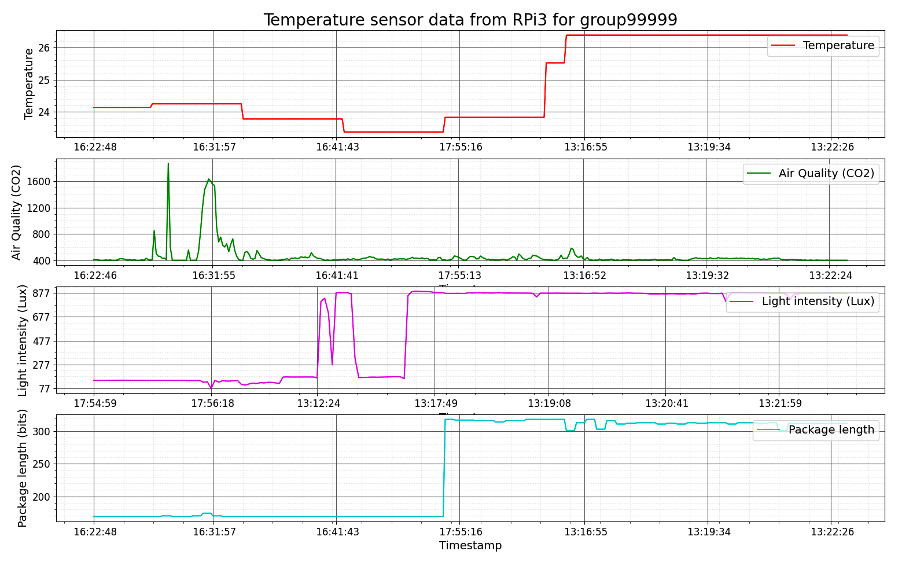

# SMART INTERNET OF THINGS (IOT) WIRELESS CONNECTIVITY IN 5G AND BEYOND

Project related to the workshop "Smart Internet of Things (IoT) wireless connectivity in 5G and Beyond"

## Installation

If you want to use our test and evaluation application, clone the repository and follow the instructions.

## Requirements

* Python 3.6+
* Linux and Windows
* See also requirements.txt and environment.yml files

## Script for installation
For the installation of the _requirements_ and _environment_ run the next script:
* Run: `./install.sh`

If you are under Windows, use directly the _environment.yml_ file to install the 
dependencies (e.g. using conda environment manager: `conda env create -f environment.yml`)

<a name="myfootnote1">1</a>: *Not tested regularly on Windows. Fully tested in Linux Ubuntu O.S.*

## Usage
By default, the application read/record in CSV format the data in: `/data/`

Please, check the input arguments options in the _main_ functions of each python script or running
`python ./scripts/smartiot_data_analysis.py`

## TODO list
 - [ ] Add configuration files with parameters 
 - [ ] Add AAU files
 - [ ] Add Mel-spectrum and Cepstrum
 - [ ] GUI
 - [ ] Visualize data - signals option
 - [ ] Code cleaning. Better API

## Authors and acknowledgment
This framework is created by the group99999 of the Center for Machine Vision and Signal Analysis (CMVS) and Center of the Wireless Communication (CWC) at the University of Oulu for the UBISS2023 Summer school:
 * Constantino Álvarez Casado (constantino.alvarezcasado [at] oulu.fi)
 * Gabriel Martins de Jesus (email)
 * Rafael Valente da Silva (email)
 * Prasoon Raghuwanshi (email)

## Useful Resources and links of some parts of the code:
- https://github.com/andreascas/aau_ubiss
- https://vbn.aau.dk/en/persons/145153

## License
For open source projects, say how it is licensed.

